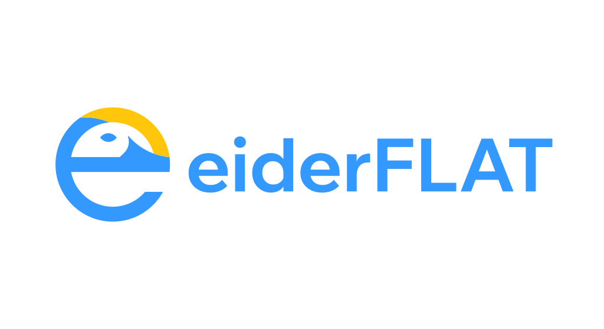

<p align="center">
  
</p>

<h1 align="center">eiderFLAT</h1>

<p align="center">
  <em>A fast, from-scratch 2D CAD system written in Rust — an exact geometry kernel under a modern, direct-manipulation interface.</em>
</p>

<p align="center">
  <a href="https://github.com/fcoltro/eiderFLAT/actions/workflows/release.yml"></a>
  <a href="https://github.com/fcoltro/eiderFLAT/releases/latest"></a>
  
  
  
</p>

---

**eiderFLAT** is a 2D CAD drafting environment built entirely from the ground up in
Rust — no CAD engine dependencies, no port of an existing kernel. It pairs the
precision of a real geometry core with the feel of a modern app: a deep,
glass-panelled dark UI, a ⌘K command palette, live snapping, and CAD-style grips
on everything you draw.

The kernel works in **f64 coordinates with tolerance-based predicates**. Lines,
circular arcs, elliptical arcs, cubic Béziers, polycurves and clamped-cubic
**NURBS** are first-class primitives. Intersections, offsets, distances, curvature
and planar booleans are computed numerically, with **Shewchuk-exact orientation
predicates** keeping boolean winding robust even on near-degenerate input. The
viewport renders through the egui painter with **adaptive, zoom-aware
tessellation** — smooth curves at any zoom, exact where it matters.

## ⬇ Download

Pre-built binaries for **Windows, Linux and macOS** (Intel + Apple Silicon) are
published on every release:

> **[→ Download the latest release](https://github.com/fcoltro/eiderFLAT/releases/latest)**

Or build it yourself in one command (see [Build & run](#-build--run)).

## ✨ Features

### Drawing
- **Line, Polyline, Circle, Arc** (3-point), **Ellipse, Rectangle, Polygon** (n-sided)
- **NURBS spline** with control-vertex authoring — draggable CV grips and per-vertex weights
- **Text** (single- and multi-line) rendered with a user-selectable on-canvas font (TTF/OTF)

### Modifying
- **Move, Copy, Rotate, Scale, Mirror, Stretch**
- **Offset** — segment-mitred for polylines/polygons, exact for NURBS
- **Trim & Extend** — span-aware and spline-preserving
- **Fillet & Chamfer** on lines and polyline corners
- **Disjoint** (explode) / **Join**, and **Hatch** — region-based solid fill with islands
- CAD-style **grips** on every selected entity — drag to reshape, or type exact values
- Contextual corner fillet/chamfer dots and bounding-box transform handles
- A floating **contextual toolbar** (duplicate, mirror, rotate, offset, delete) above the selection

### Workspace & UI
- **Layers** with colour, show/hide, rename and current-layer — seeded with a sensible default set
- Editable **Properties inspector**: geometry, measurements, line weight, line type and layer
- **Object snapping** — Endpoint, Midpoint, Center, Quadrant, Intersection, Perpendicular, Tangent, Nearest, Node, Insertion
- Grid + grid snap, **polar / angle guides**, and a **dynamic input HUD**
- Window / crossing marquee, hover highlight, and ghost previews for transforms
- **⌘K / Ctrl+K command palette** plus an always-available command line
- **Drawing units** (mm / cm / m / km / in / ft / unitless) that bound the zoom range
- Modern dark, glass-panelled interface — top bar, tool dock, inspector, status pill

### Geometry kernel
- Exact **boolean region** ops (union / intersection / difference / xor) via Greiner–Hormann clipping with robust winding
- **Shewchuk-exact** orientation predicates
- Adaptive **quadtree + Morton-code** spatial index for fast picking and queries
- Numeric intersect / distance / curvature / offset / split-reverse operations
- Affine **transforms** (translate, rotate, scale, mirror) with reflection-correct arcs

### Interoperability
- Native **`.e2d`** format (lossless)
- **DXF** (ASCII) import & export
- **SVG** import & export

## ⌨ Commands

Type a word in the command line (or use the toolbars / palette). Common aliases:

| Draw | | Modify | | Other | |
|------|--|--------|--|-------|--|
| `LINE` / `L` | Line | `MOVE` / `M` | Move | `SELECT` / `SE` | Select |
| `POLYLINE` / `PL` | Polyline | `COPY` / `CO` | Copy | `ERASE` / `E` / `DEL` | Delete |
| `CIRCLE` / `C` | Circle | `ROTATE` / `RO` | Rotate | `DISJOINT` / `X` | Disjoint (explode) |
| `ARC` / `A` | Arc (3-pt) | `SCALE` / `SC` | Scale | `JOIN` / `J` | Join |
| `ELLIPSE` / `EL` | Ellipse | `MIRROR` / `MI` | Mirror | `HATCH` / `H` | Hatch |
| `RECTANGLE` / `REC` | Rectangle | `OFFSET` / `O` | Offset | `UNDO` / `U` | Undo |
| `POLYGON` / `POL` | Polygon | `TRIM` / `TR` | Trim | `REDO` | Redo |
| `SPLINE` / `SPL` | NURBS spline | `EXTEND` / `EX` | Extend | `ALL` | Select all |
| `TEXT` / `T` / `MTEXT` | Text | `FILLET` / `F` | Fillet | `ZOOM` / `Z` | Zoom |
| | | `CHAMFER` / `CHA` | Chamfer | `LAYER` / `LA` | Layers |
| | | `STRETCH` / `S` | Stretch | | |

Coordinate entry supports `x,y` (absolute), `@dx,dy` (relative), `d<a` (polar
absolute) and `@d<a` (polar relative, degrees).

## 🔨 Build & run

Plain Cargo, no special toolchain — just a Rust toolchain (stable).

```sh
cargo build --workspace
cargo test  --workspace

cargo run -p eiderflat_app          # launch the interactive CAD window
cargo run -p eiderflat_app -- demo  # headless geometry-kernel demo
```

> **Linux build dependencies:** the file dialogs use GTK, so install
> `libgtk-3-dev` (Debian/Ubuntu: `sudo apt-get install libgtk-3-dev`) before building.

## 🧱 Architecture

eiderFLAT is a Cargo **workspace** — the kernel is fully decoupled from the UI, so
every crate below `eiderflat_ui` is headless and independently testable.

| Crate | Responsibility |
|-------|----------------|
| `eiderflat_geometry` | Curve primitives (line, arc, ellipse, cubic, polycurve, NURBS), transforms, ops (intersect / distance / curvature / offset / split) |
| `eiderflat_spatial` | Adaptive quadtree + Morton-code spatial index |
| `eiderflat_boolean` | Planar region boolean ops (union / intersection / difference / xor) with robust winding |
| `eiderflat_document` | Document / layer / entity / block model |
| `eiderflat_cad` | Snapping, selection, grips, draw + edit (trim / extend / fillet / chamfer / offset / hatch / …) |
| `eiderflat_io` | DXF, SVG and native `.e2d` import / export |
| `eiderflat_ui` | Headless app state + egui view (toolbars, canvas, panels, command palette) |
| `apps/eiderflat_app` | eframe GUI host + headless kernel demo |

> The `eiderflat_*` crate prefix and the `.e2d` format magic are internal
> identifiers kept for stability; the product is named **eiderFLAT**.

## 📄 License

**eiderFLAT is free software, licensed under the GNU General Public License v3.0 or
later** (`GPL-3.0-or-later`) — see [LICENSE](LICENSE). You may use, study, modify
and redistribute it under those terms; derivative works must remain GPL-licensed
and share their source.
